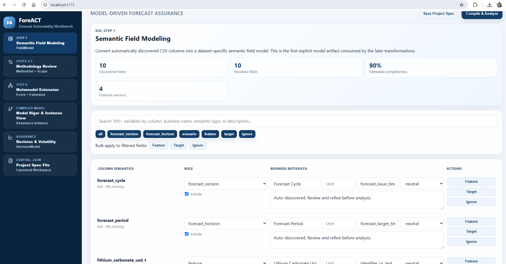
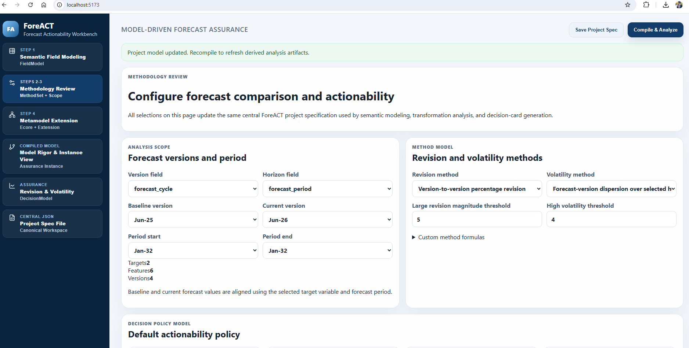
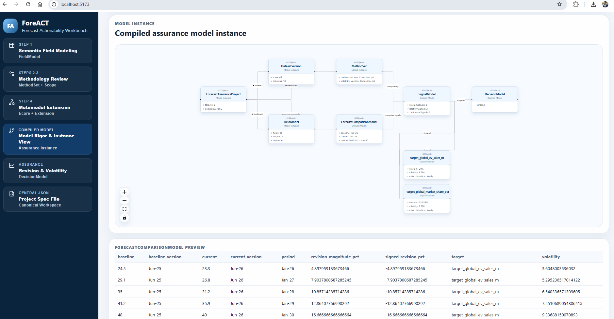
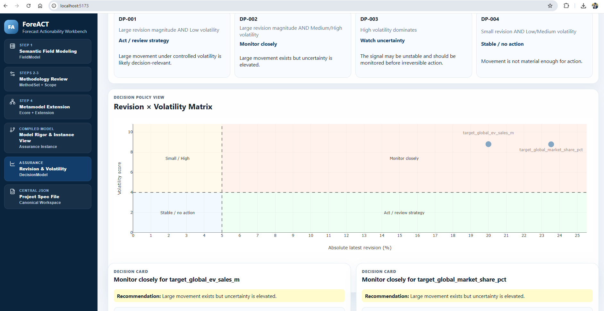
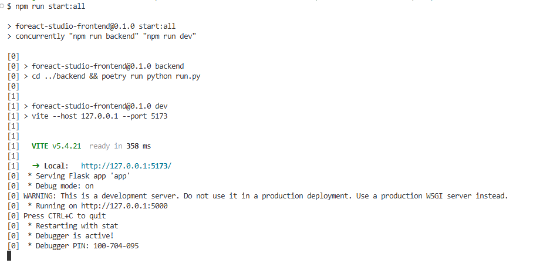
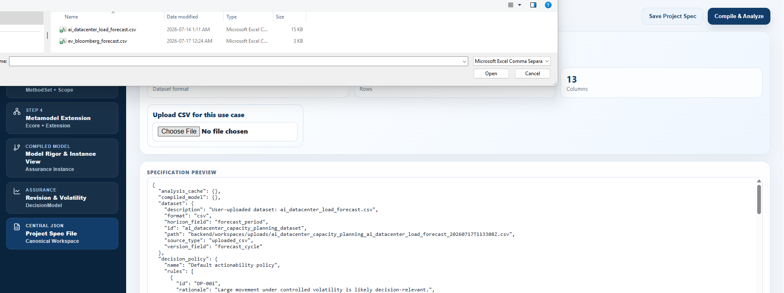
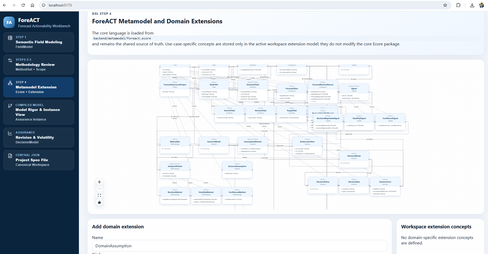
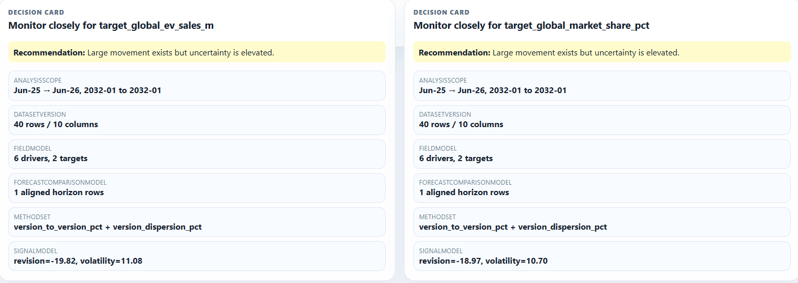

# ForeACT

ForeACT is a model-driven workbench for assessing the actionability of forecast changes. It helps users compare forecast vintages, compute forecast revisions and volatility, configure decision policies, and generate traceable decision artifacts.

## Demo


## Main Features

| Semantic Field Modeling                                             | Methodology Review                                        |
| ------------------------------------------------------------------- | --------------------------------------------------------- |
|  |  |

| Compiled Forecast Assurance Model                                              | Revision-Magnitude--Volatility Matrix                                                |
| ------------------------------------------------------------------------------ | ------------------------------------------------------------------------------------ |
|  |  |

ForeACT supports the following workflow:

1. Upload and profile forecast data.
2. Assign semantic roles to dataset fields.
3. Select baseline and current forecast vintages.
4. Configure the target-period range and analytical methods.
5. Inspect the forecast-actionability metamodel and define domain-specific extensions.
6. Compile the project specification into a forecast assurance model.
7. Apply metamodel-derived structural and analysis-readiness checks.
8. Compute forecast revisions, revision magnitudes, volatility, and confidence signals.
9. Generate a revision-magnitude--volatility matrix and traceable decision cards.

## Architecture

ForeACT uses one canonical Ecore metamodel:

```text
backend/metamodel/foreact.ecore
```

The backend loads this file using PyEcore and projects its structure into JSON for the frontend. The React application does not maintain a separate hard-coded TypeScript copy of the metamodel.

The metamodel flow is:

```text
backend/metamodel/foreact.ecore
  → PyEcore loader
  → GET /api/metamodel
  → frontend metamodel projection
  → compiled forecast assurance model
  → analytical and decision views
```

The metamodel uses:

* inheritance;
* containment relationships;
* typed associations;
* semantic field entities;
* forecast-comparison entities;
* analytical method and signal entities;
* decision entities; and
* traceability relation types.

In the metamodel visualization:

* inheritance is shown using `extends`;
* containment is shown using `◆`; and
* regular references are shown as labeled associations.

Project-specific domain concepts are maintained separately from the core metamodel in ForeACT project specifications. An example workspace is:

```text
backend/workspaces/ai_datacenter_capacity.foreact.json
```

## Main Workbench Views

1. **Semantic Field Modeling**
   Profiles the uploaded dataset and assigns modeling roles such as forecast vintage, target period, target, driver, scenario, or ignored field.

2. **Methodology Review**
   Configures baseline and current vintages, target periods, revision-magnitude methods, volatility methods, confidence methods, and decision thresholds.

3. **Metamodel Viewer and Domain Extensions**
   Visualizes the core Ecore metamodel and supports project-level domain-specific concepts without modifying the core metamodel.

4. **Model Rigor and Instance View**
   Displays the compiled forecast assurance model together with metamodel-derived structural, analysis-readiness, and traceability checks.

5. **Forecast Revision and Volatility Analysis**
   Presents signed revisions, revision magnitudes, volatility and confidence signals, the revision-magnitude--volatility matrix, and decision cards.

6. **Project Specification**
   Displays the dataset-specific ForeACT project specification used to preserve semantic mappings, analytical choices, thresholds, and domain extensions.

## Repository Structure

```text
ForeACT/
├── backend/
│   ├── metamodel/
│   │   └── foreact.ecore
│   ├── workspaces/
│   │   └── ai_datacenter_capacity.foreact.json
│   ├── app/
│   ├── run.py
│   └── pyproject.toml
├── frontend/
│   ├── src/
│   ├── package.json
├── └── vite.config.ts
```

Create the `docs/images` and `docs/demo` directories if they are not already present.

## Prerequisites

Install the following tools before running ForeACT:

* Python;
* Poetry;
* Node.js;
* npm.

Use the Python and Node.js versions specified by the project configuration files, where available.

## Run the Backend

From the repository root:

```bash
cd backend
poetry install
poetry run python run.py
```

The terminal should indicate that the backend server is running.


## Run the Frontend

Open a second terminal:

```bash
cd frontend
npm install
npm run dev
```

The terminal will display the local frontend URL.


Open the displayed URL in a browser.

## Run the Backend and Frontend Together

The frontend package also provides a combined development command:


```bash
cd frontend
npm install
npm run start:all
```

This command starts the backend and frontend development servers together.

## Step-by-Step Demonstration

### Step 1: Upload a Dataset

Open the data catalog and upload a forecast dataset in CSV format. ForeACT profiles the dataset and reports its fields, data types, missing values, and available forecast vintages and target periods.



### Step 2: Define Semantic Field Roles

Use the semantic field modeling view to identify the forecast-vintage field, target-period field, target fields, drivers, and optional scenario fields.


### Step 3: Configure the Methodology

Select the baseline and current forecast vintages, target-period range, revision-magnitude method, volatility method, confidence method, and decision thresholds.


### Step 4: Inspect the Metamodel

Inspect the Ecore classes, attributes, inheritance relationships, containment relationships, and associations used by ForeACT. Domain-specific concepts may be added as project-level extensions.



### Step 5: Compile and Validate the Project

Compile the current project specification into a typed forecast assurance model. ForeACT resolves the required types against the active Ecore metamodel and applies metamodel-derived structural and analysis-readiness checks.


### Step 6: Review Analytical Results

ForeACT aligns forecast values across selected vintages and computes:

* signed forecast revisions;
* absolute or percentage revision magnitudes;
* multi-vintage forecast volatility;
* confidence signals; and
* decision-policy results.


### Step 7: Inspect the Decision Matrix

The revision-magnitude--volatility matrix places each selected target into a decision-policy region, such as monitoring, review, investigation, or action.


### Step 8: Review Decision Cards

Decision cards summarize the selected target, target period, analytical signals, recommended action, and rationale. They remain connected to the selected forecast vintages, methods, thresholds, and supporting analytical records.



## Demonstration Datasets

The repository includes two datasets for demonstrating ForeACT:

1. **Electric vehicle outlook dataset**
   A real-world dataset containing EV-related historical and projected values. Multiple forecast vintages are constructed for the demonstration.

2. **AI data-center electricity-demand dataset**
   A synthetically generated dataset designed to illustrate forecast revisions, volatility, confidence, and domain-specific planning assumptions.

The datasets are intended to demonstrate how the same forecast-assurance workflow can be configured for different planning contexts.


## Current Scope

ForeACT is a demonstrable research workbench rather than a production forecasting platform. It does not replace forecasting models, notebooks, experiment-tracking systems, or planning dashboards. It provides a model-driven assurance layer for interpreting forecast revisions and preserving the analytical basis of decision recommendations.